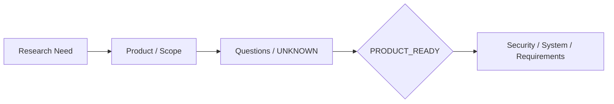
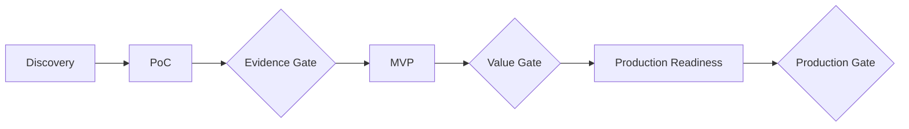
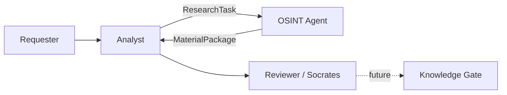
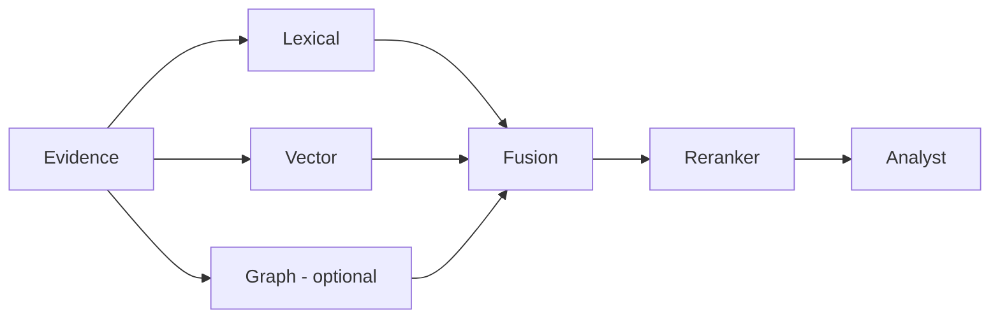
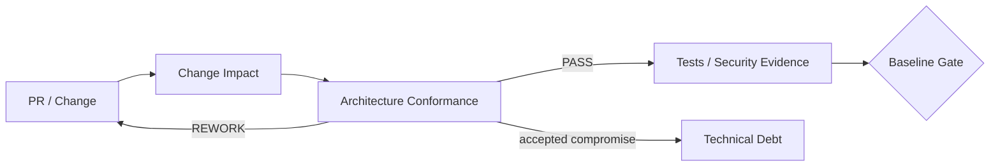
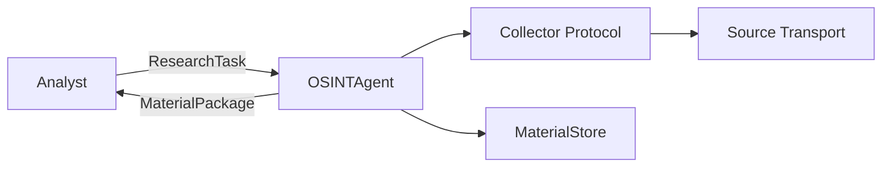
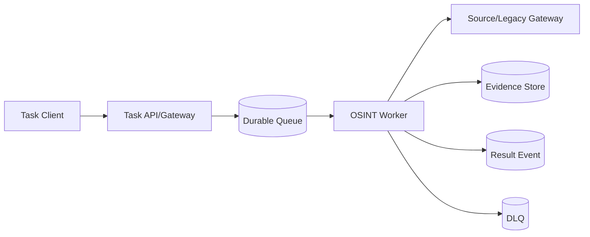
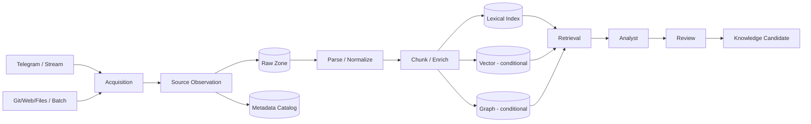

# FATHER OSINT Agent — канонический review ДЗ 01–12

**Проект:** `VictorKVS/OSINT_deepseek`  
**Режим:** один реальный проект проходит через уроки 01–20  
**Статус:** `LESSONS 01–12 DOCUMENTED / READY FOR HUMAN REVIEW`  
**Принцип:** учебная документация объясняет и нормализует реальный проект; отсутствие evidence не заполняется догадкой.

---

## 1. Один проект вместо двенадцати несвязанных ДЗ

Курс используется как последовательный архитектурный lifecycle одного OSINT/Knowledge Factory решения.


### Текущее состояние проекта

| Область | Состояние |
|---|---|
| DEV baseline | `EXISTING_VERIFIED` |
| Technical PoC | `ACTIVE / evidence-producing path` |
| MVP | `NOT YET OWNER-SELECTED` |
| RAG | `CANDIDATE / EVAL REQUIRED` |
| Multi-Agent | `CANDIDATE / SECURITY + VALUE PROOF REQUIRED` |
| Async broker path | `CANDIDATE / REQUIREMENT-TRIGGERED` |
| Production storage products | `NOT SELECTED` |
| Feature Store | `NOT REQUIRED FOR CURRENT CORE / CONDITIONAL` |
| Production readiness | `NOT CLAIMED` |

---

## 2. Что добавляет каждый урок

| № | Слой | Главный результат | Статус |
|---:|---|---|---|
| 01 | Product / Presale | Business Need, Vision, Scope, Authority, UNKNOWN, Product Ready | `CONDITIONAL_PASS` |
| 02 | Feasibility | NFR, WBS/Estimate v0, Risks, TCO inputs, Change | `CONDITIONAL_PASS` |
| 03 | Delivery strategy | PoC → MVP → Production gates and contract logic | `CONDITIONAL_PASS` |
| 04 | HLD / C4 | C1, C2, architecture drivers | `CONDITIONAL_PASS` |
| 05 | LLD | C3, sequences, candidate API contract | `CONDITIONAL_PASS` |
| 06 | RAG | retrieval options, hybrid candidate, eval/security rules | `CANDIDATE` |
| 07 | Agents | roles, handoffs, privilege/security boundaries | `CANDIDATE` |
| 08 | ADR | immutable decision history and ADR-0001..0003 | `PASS` |
| 09 | CTO Challenge | LLM hosting trade-off + ADR-0004 | `READY FOR REVIEW` |
| 10 | Governance | conformance review + PR checklist + technical debt | `CONDITIONAL_PASS` |
| 11 | Integrations | current boundaries + reliable async candidate + MCP/A2A applicability | `CONDITIONAL_PASS` |
| 12 | Data Architecture | end-to-end pipeline + storage roles + lineage + Feature Store decision | `CONDITIONAL_PASS` |

---

# Урок 01 — Пресейл и требования

Сначала восстановлен слой, который должен существовать до технической архитектуры: **зачем нужен продукт, для кого, какие границы, кто имеет право принять решение и что пока неизвестно**.

OSINT Agent определён не как «машина истины», а как поставщик evidence/provenance для Analyst/Reviewer.



`PRODUCT_READY = CONDITIONAL_PASS`: миссия/границы подтверждены; Production KPI, Legal/Data authority, SLO и budget baseline остаются открытыми.

---

# Урок 02 — Требования → оценка → риски → стоимость

Между требованиями и архитектурой появился слой Delivery Feasibility:

```text
Requirements
→ measurable NFR
→ WBS v0
→ Estimate v0
→ Project Risk
→ TCO inputs
→ Change Control
```

**Estimate v0** нужен до архитектуры для диапазона/неопределённости. **Estimate v1** должен появляться после архитектурного решения и измерений.

Числовые цели не копируются из учебных примеров: без baseline используется `TO_BE_BASELINED / UNKNOWN`.

---

# Урок 03 — PoC → MVP → Production

Разделены три разных вопроса:

- **PoC:** технически возможно?
- **MVP:** полезно реальному пользователю?
- **Production:** безопасно и устойчиво эксплуатировать?

Текущий DEV baseline не называется MVP. TDLib/Telegram evidence path рассматривается как technical PoC. Product MVP должен отдельно выбрать владелец.



---

# Урок 04 — HLD / C4

Существующая архитектура нормализована в C1/C2 без преждевременного выбора конкретной инфраструктуры.



Контейнеры ответственности: `Acquisition → Research Orchestration → Evidence Persistence → Analysis → Review`.

PostgreSQL/Kafka/Qdrant/Kubernetes/конкретный LLM здесь не являются архитектурными фактами.

---

# Урок 05 — LLD

C3 и sequence views построены вокруг реальных контрактов:

`ResearchTask → OSINTAgent → Collector → Material → MaterialStore → MaterialPackage`.

Документированы success/failure/follow-up сценарии, включая ключевой provenance invariant: одинаковый raw payload может переиспользоваться, но независимые source observations не исчезают.

OpenAPI существует как **candidate adapter**, а не как ложное описание текущего DEV runtime.

---

# Урок 06 — RAG

RAG расположен **после** acquisition/evidence preservation, а не внутри Collector.



Зрелость: `lexical → vector → hybrid → reranker → graph only if measured value exists`.

Инварианты:
- similarity ≠ truth;
- retrieved content ≠ instruction;
- generated answer ≠ evidence.

`RAG = CANDIDATE / EVAL REQUIRED`.

---

# Урок 07 — AI Agents / Multi-Agent

Роли разделены по single responsibility:

`Manager/Analyst → OSINT Research Agent → Tools/Collectors → Evidence/RAG → Verifier → Human/Knowledge Gate`.

Каждый handoff должен переносить task/trace ID, scope, allowed tools, limits, evidence refs, stop condition и privilege ceiling.

Архитектура учитывает prompt injection, tool abuse, runaway loops, confused deputy и cross-agent privilege escalation.

---

# Урок 08 — ADR

Из реальных решений оформлены:

- ADR-0001 — OSINT является evidence supplier;
- ADR-0002 — source observation ≠ stored raw payload;
- ADR-0003 — follow-up research bounded + cumulative.

Стандарт:

`Context → Alternatives → Evidence → Decision → Consequences → Verification → Revisit trigger`.

История не переписывается: новое решение supersedes старое.

---

# Урок 09 — CTO Challenge / LLM Hosting

Сравнены Hosted API, Cloud GPU, On-prem GPU и Hybrid.

Текущее решение стадии: **hosted LLM API через replaceable Model Gateway только для данных, разрешённых к внешней обработке**. Sensitive/UNKNOWN evidence fail-closed и наружу не отправляется.

Финальный Production-hosting выбор отложен до measured workload, quality, SLO и TCO.

> На PoC/MVP выгоднее сначала купить знание о реальной нагрузке и качестве, чем заранее купить инфраструктуру.

---

# Урок 10 — Архитектурный надзор и технический долг

После ADR возникает следующий вопрос: **как не дать реализации разойтись с принятой архитектурой**.

## Architectural Conformance



Материальный change review проверяет:

- requirement/business outcome;
- C4/C3 boundaries;
- interface/data contract;
- provenance;
- security/trust boundary;
- external dependency;
- operability/rollback;
- tests/evidence;
- ADR impact.

## Debt ≠ defect

```text
DEFECT = approved contract violated now
RISK   = uncertain exposure may cause harm
DEBT   = known compromise accepted now
FEATURE = desired capability not currently required
```

Текущий debt register содержит только реальные компромиссы:

1. local append-only DEV persistence;
2. deterministic Analyst/Reviewer harnesses colocated with OSINT core;
3. manually synchronized Markdown/Mermaid architecture views;
4. cross-repository OTUS mirror duplication.

Старый provenance/dedup defect **не** переносится в debt: текущий store уже сохраняет observation отдельно от reusable payload.

`LESSON_10_GOVERNANCE = CONDITIONAL_PASS`.

---

# Урок 11 — Проектирование интеграций

Текущий DEV сохраняется простым:



Telegram уже показывает правильную границу: `TelegramCollector` зависит от transport-neutral `TelegramTransport`, поэтому TDLib/GramJS/другая реализация транспорта не должна менять Analyst contract.

## Когда нужен broker

Broker/async path — **candidate**, а не текущая необходимость.



Активировать его стоит только при реальной потребности в durable buffering, long-running jobs, replay, backpressure или independent worker scaling.

### Выбор механизмов

| Механизм | Роль |
|---|---|
| HTTP/REST | external request/status/result API candidate |
| gRPC | typed internal service boundary candidate |
| Message Broker | durable async work candidate |
| ETL/ELT | batch/backfill/data preparation |
| MCP | future controlled tool/resource boundary |
| A2A | future independently deployed agent coordination |
| ONNX | model portability format; не message bus |

Принцип: `interaction need → reliability/security/data constraints → simplest adequate pattern → technology`.

`LESSON_11_INTEGRATION_ARCHITECTURE = CONDITIONAL_PASS`.

---

# Урок 12 — Архитектура данных для AI-систем

OSINT/Knowledge Factory уже имеет естественный data lifecycle; урок 12 делает его явной data architecture.

## End-to-end pipeline



### Raw-first rule

Сначала сохраняется original/raw + provenance + integrity metadata, потом выполняются transformations. Поэтому parser/model/index можно обновлять и переигрывать без потери исходного evidence.

## Storage selection

| Data role | Storage class |
|---|---|
| Raw/original evidence | object storage / Data Lake candidate |
| Observation/task/version metadata | relational DB / catalog candidate |
| Lexical retrieval | search index |
| Semantic retrieval | Vector DB/index only after eval |
| Relation traversal | graph store only when use case justifies |
| Eval/training datasets | versioned object/lakehouse registry |
| Telemetry analytics | warehouse/lakehouse when needed |
| Shared offline/online ML features | Feature Store conditionally |

Конкретный продукт не выбирается раньше workload/SLO/ops evidence.

## Feature Store

Текущее решение:

`FEATURE_STORE = NOT_REQUIRED_FOR_CURRENT_CORE`

Core OSINT сейчас не обслуживает supervised online features. Feature Store становится нужен, когда утверждённая модель использует одни и те же engineered features offline и online.

Training-serving skew предотвращается через:

`one canonical feature definition → versioned transform → point-in-time correct offline values → same online definition → model/feature version trace`.

RAG имеет похожую consistency-проблему: chunking version, embedding model, metadata schema и index generation должны совпадать между evaluation и serving.

## Data Governance / Lineage

```text
source
→ observation
→ raw hash/file
→ parser version
→ chunk
→ embedding/extraction/index version
→ retrieval hit
→ claim/entity/relation
→ review
→ knowledge candidate
→ gate
```

Каждый material derivative должен оставаться объяснимым и, где требуется, rebuildable/retractable.

`LESSON_12_DATA_ARCHITECTURE = CONDITIONAL_PASS`.

---

# 13. Что доказано / что ещё требует evidence

| Поддержано сейчас | Ещё не доказано |
|---|---|
| bounded OSINT contract + role separation | конкретный Product MVP + KPI |
| provenance/source observation semantics | Production workload/SLO |
| C4/LLD responsibility model | final deployment topology |
| ADR + architecture governance process | automated conformance runtime |
| transport-neutral integration boundary | need/product choice for broker/API/MCP/A2A |
| raw-first data/lineage model | Production storage product choices |
| current DEV store semantics | Production retention/deletion/legal matrix |
| conditional RAG/agent design | measured Production quality/security/value |
| Feature Store applicability decision | first model that really requires shared features |

---

# 14. Главные улучшения после урока 12

### P0

- Production Legal/Data applicability;
- data classification + retention + deletion + external-processing matrix;
- tool/privilege/untrusted-content policy до executable agents.

### P1

- Production NFR baseline;
- real MVP + value metric;
- versioned Eval/Golden Dataset;
- architecture-as-code/conformance automation;
- integration timeout/retry/replay/idempotency NFR;
- versioned event/message schemas if async is promoted;
- dataset/index version registry + rebuild/migration;
- lineage validation;
- per-stage data quality telemetry;
- lexical/vector/graph benchmark before selecting Production stores.

---

# 15. Итог после двенадцати уроков

Теперь проект проходит уже не только путь **«придумали → спроектировали → защитили»**, но и следующий уровень зрелости:

```text
потребность
→ требования
→ оценимость
→ PoC/MVP/Prod strategy
→ HLD
→ LLD
→ RAG
→ Agents
→ ADR
→ CTO Challenge
→ Architectural Governance
→ Integration Architecture
→ Data Architecture & Governance
```

Главный результат уроков 10–12: архитектура стала не только объяснимой, но и **поддерживаемой во времени** — изменения можно проверять на conformance, интеграции можно эволюционировать без разрыва семантических контрактов, а данные получают явную lineage/version/governance модель.

Production readiness всё ещё сознательно не заявляется. Следующие уроки должны дать quality gates, Security by Design, observability, sizing, CI/CD, MLOps и Production deployment evidence.

---

## Canonical references

- `docs/course_live_reproduction/01_product/`
- `02_delivery_feasibility/`
- `03_poc_to_production/`
- `04_hld_c4/`
- `05_lld/`
- `06_rag/`
- `07_agents/`
- `08_adr/`
- `09_cto_challenge/`
- `10_architecture_governance/`
- `11_integrations/`
- `12_data_architecture/`
- `IMPROVEMENT_BACKLOG.md`
- `00_MASTER_ARTIFACT_REGISTER.yaml`

**Source of truth:** `VictorKVS/OSINT_deepseek`, branch `feature/otus-live-reproduction-01-20`.
