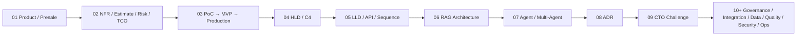
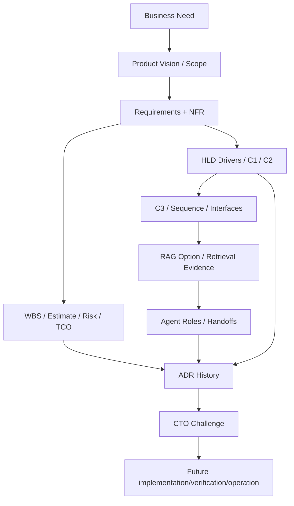

# FATHER OSINT Agent — Lessons 01–09 Master Review

Status: `DOCUMENTATION MILESTONE / READY TO INSPECT BEFORE OTUS LESSON 09 SUBMISSION`

## One project, one lifecycle



The implementation was not changed by this course pass. The documents reconstruct upstream intent, normalize existing architecture and prepare future decisions around the already existing OSINT project.

## Lesson matrix

| Lesson | Project layer | Main deliverables | Result |
|---|---|---|---|
| 01 | Product / presale | Business Need, Vision, stakeholders/authority, scope, metrics, assumptions/UNKNOWN, Product Ready | `CONDITIONAL_PASS` |
| 02 | Feasibility | NFR baseline, WBS/Estimate v0, risk crosswalk, TCO/change/eval inputs | `CONDITIONAL_PASS` |
| 03 | Value delivery | discovery questions, contract strategy, PoC/MVP/Prod roadmap, risks, gates | `CONDITIONAL_PASS` |
| 04 | HLD / C4 | C1, C2, trust boundaries, driver trace | `CONDITIONAL_PASS` |
| 05 | LLD | C3, key sequences, candidate OpenAPI adapter | `CONDITIONAL_PASS` |
| 06 | RAG | applicability/options, hybrid RAG candidate, quality/security contract | `CANDIDATE / EVAL REQUIRED` |
| 07 | Agents | role decomposition, handoffs/RAG flow, multi-agent security contract | `CANDIDATE / VALUE+SECURITY PROOF REQUIRED` |
| 08 | ADR | ADR process/template + retrospective ADR-0001..0003 | `PASS FOR DOCUMENTATION DISCIPLINE` |
| 09 | Architecture verification | hosting drivers, trade-off, TCO inputs, ADR-0004, CTO Challenge | `READY FOR HOMEWORK REVIEW` |

## Current lifecycle truth

```text
DEV BASELINE       = EXISTING_VERIFIED
TECHNICAL POC      = ACTIVE / evidence-producing path
MVP PRODUCT        = NOT YET OWNER-SELECTED
RAG                = CANDIDATE / NOT CLAIMED IMPLEMENTED
PRODUCTION AGENTS  = CANDIDATE / NOT CLAIMED IMPLEMENTED
PRODUCTION READY   = NOT CLAIMED
```

## Documentation tree

```text
docs/course_live_reproduction/
├─ README.md
├─ 00_MASTER_ARTIFACT_REGISTER.yaml
├─ 00_REUSE_MAP.md
├─ IMPROVEMENT_BACKLOG.md
├─ LESSONS_01_09_MASTER_REVIEW.md
├─ 01_product/
│  ├─ 01_BUSINESS_NEED.md
│  ├─ 02_PRODUCT_VISION.md
│  ├─ 03_STAKEHOLDERS_AND_AUTHORITY.md
│  ├─ 04_SCOPE_BASELINE.md
│  ├─ 05_SUCCESS_METRICS.md
│  ├─ 06_ASSUMPTION_UNKNOWN_LOG.md
│  └─ 07_PRODUCT_READY_DECISION.md
├─ 02_delivery_feasibility/
│  ├─ README.md
│  ├─ 01_NFR_BASELINE.md
│  ├─ 02_WBS_ESTIMATE_V0.md
│  ├─ 03_PROJECT_RISK_CROSSWALK.md
│  ├─ 04_TCO_CHANGE_EVAL_INPUTS.md
│  └─ 05_LESSON_02_REVIEW.md
├─ 03_poc_to_production/
│  ├─ 01_DISCOVERY_QUESTIONS.md
│  ├─ 02_DELIVERY_STRATEGY_AND_CONTRACT.md
│  ├─ 03_POC_MVP_PROD_ROADMAP.md
│  ├─ 04_RISK_MATRIX.md
│  ├─ 05_STAGE_GATE_CRITERIA.md
│  └─ 06_LESSON_03_REVIEW.md
├─ 04_hld_c4/
│  ├─ README.md
│  ├─ 01_C1_SYSTEM_CONTEXT.md
│  ├─ 02_C2_CONTAINERS.md
│  ├─ 03_HLD_DRIVER_TRACE.md
│  └─ 04_LESSON_04_REVIEW.md
├─ 05_lld/
│  ├─ README.md
│  ├─ 01_C3_RESEARCH_ORCHESTRATION.md
│  ├─ 02_SEQUENCE_SCENARIOS.md
│  ├─ 03_OPENAPI_CANDIDATE.yaml
│  └─ 04_LESSON_05_REVIEW.md
├─ 06_rag/
│  ├─ README.md
│  ├─ 01_RAG_APPLICABILITY_AND_OPTIONS.md
│  ├─ 02_HYBRID_RAG_CANDIDATE.md
│  └─ 03_RAG_QUALITY_SECURITY_REVIEW.md
├─ 07_agents/
│  ├─ README.md
│  ├─ 01_AGENT_ROLE_MODEL.md
│  ├─ 02_AGENT_HANDOFFS_AND_RAG_FLOW.md
│  └─ 03_MULTI_AGENT_SECURITY_AND_REVIEW.md
├─ 08_adr/
│  ├─ README.md
│  ├─ ADR_TEMPLATE.md
│  ├─ ADR-0001-osint-evidence-supplier-boundary.md
│  ├─ ADR-0002-observation-vs-payload-identity.md
│  └─ ADR-0003-bounded-follow-up-research.md
└─ 09_cto_challenge/
   ├─ README.md
   ├─ 01_HOSTING_DRIVERS.md
   ├─ 02_CLOUD_VS_SELFHOSTED_TRADEOFF.md
   ├─ 03_TCO_INPUTS_AND_GAPS.md
   ├─ ADR-0004-llm-hosting-policy.md
   ├─ 04_CTO_CHALLENGE.md
   └─ 05_LESSON_09_REVIEW.md
```

## End-to-end evidence trace now visible



## Lesson 09 decision in one sentence

For the **current PoC/MVP semantic-model phase**, use a hosted LLM API behind a provider-neutral gateway only for data approved for external processing; sensitive/unclassified evidence is blocked from that path, and final Production self-hosting/cloud/on-prem choice waits for measured quality, workload, SLO and TCO evidence.

## Critical UNKNOWNs still visible

### Product
- first approved external/commercial MVP;
- product KPI baseline.

### Legal/Data
- production legal/compliance authority;
- data classification/retention/external-processing matrix.

### Operations
- production p95 latency/availability/freshness/throughput/concurrency targets;
- capacity and storage growth profile.

### AI/RAG
- first versioned project eval/golden set;
- selected embedding/reranker/generator/local-model candidates;
- measured hosted vs local quality.

### Finance
- current provider/cloud/hardware quotes;
- measured token/workload profile;
- operations staffing cost;
- comparable TCO winner.

## Highest-priority improvements before later Production claims

1. `P0` — legal/data applicability and external-processing policy.
2. `P0` — untrusted-content/tool permission controls before executable agents.
3. `P1` — measurable Production NFR baselines.
4. `P1` — first real MVP selection and value metric.
5. `P1` — versioned RAG/LLM evaluation dataset.
6. `P1` — current-stage Model Gateway contract and compliance tests before runtime dependency.
7. `P1` — measured telemetry/TCO and comparable local-model benchmark before Production hosting ADR.
8. `P1` — independent architecture review/sign-off for material ADRs.

## Readiness for OTUS Lesson 09 submission

The course mirror in `VictorKVS/OTUS-` contains `FATHER_OSINT_ANSWER.md` for Lessons 01–09. Lesson 09 now has:

- explicit options;
- required comparison criteria;
- honest missing TCO inputs;
- a concrete current-stage decision;
- ADR consequences/trade-offs;
- rollback/revisit triggers;
- CTO pitch;
- improvement list.

The package is therefore ready for human review before submission; no claim is made that Production readiness or the final Production LLM hosting decision is complete.
