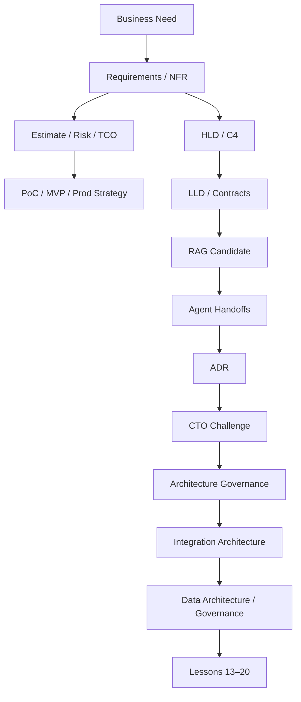

# FATHER OSINT Agent — Lessons 01–12 Master Review

Status: `TECHNICAL INVENTORY / LESSONS 01–12 DOCUMENTED`

This file is the audit-oriented companion to `CANONICAL_DZ_REVIEW_01_12.md`.

## Lesson status

| Lesson | Package | State |
|---:|---|---|
| 01 | `01_product/` | CONDITIONAL_PASS |
| 02 | `02_delivery_feasibility/` | CONDITIONAL_PASS |
| 03 | `03_poc_to_production/` | CONDITIONAL_PASS |
| 04 | `04_hld_c4/` | CONDITIONAL_PASS |
| 05 | `05_lld/` | CONDITIONAL_PASS |
| 06 | `06_rag/` | CANDIDATE_EVAL_REQUIRED |
| 07 | `07_agents/` | CANDIDATE_SECURITY_VALUE_PROOF_REQUIRED |
| 08 | `08_adr/` | PASS_DOCUMENTATION_DISCIPLINE |
| 09 | `09_cto_challenge/` | READY_FOR_HOMEWORK_REVIEW |
| 10 | `10_architecture_governance/` | CONDITIONAL_PASS |
| 11 | `11_integrations/` | CONDITIONAL_PASS |
| 12 | `12_data_architecture/` | CONDITIONAL_PASS |

## New artifacts added in Lessons 10–12

### Lesson 10

- `01_ARCHITECTURAL_CONFORMANCE_MODEL.md`
- `02_PR_ARCHITECTURE_REVIEW_CHECKLIST.md`
- `03_TECH_DEBT_REGISTER.md`
- `04_LESSON_10_REVIEW.md`

### Lesson 11

- `01_INTEGRATION_LANDSCAPE.md`
- `02_RELIABLE_ASYNC_INTEGRATION_CANDIDATE.md`
- `03_AI_INTEGRATION_STANDARDS_APPLICABILITY.md`
- `04_LESSON_11_REVIEW.md`

### Lesson 12

- `01_END_TO_END_DATA_PIPELINE.md`
- `02_STORAGE_SELECTION.md`
- `03_DATA_GOVERNANCE_LINEAGE.md`
- `04_FEATURE_STORE_APPLICABILITY.md`
- `05_LESSON_12_REVIEW.md`

## End-to-end trace after Lesson 12



## Current architecture truth

```text
DEV baseline             EXISTING_VERIFIED
Technical PoC            ACTIVE
MVP                       OWNER_DECISION_REQUIRED
RAG                       CANDIDATE
Production Agents         CANDIDATE
LLM hosting policy        CURRENT_STAGE_CONDITIONAL
Architecture governance   DOCUMENTED
Async broker              CANDIDATE_REQUIREMENT_TRIGGERED
Data pipeline             DOCUMENTED
Production store products NOT_SELECTED
Feature Store             CONDITIONAL_NOT_REQUIRED_CURRENT_CORE
Production Ready          NOT_CLAIMED
```

## Current P0 blockers before Production claims

- named Production Legal/Compliance authority and applicability decision;
- data classification / retention / deletion / external-processing matrix;
- tool/privilege/untrusted-content policy before executable agents;
- required Production SLO/NFR and operational acceptance evidence.

## Source-of-truth hierarchy

1. Current implementation/tests and existing canonical root docs for implemented behavior.
2. `00_MASTER_ARTIFACT_REGISTER.yaml` for lifecycle/artifact inventory.
3. Lesson packages for course-normalized views and candidate designs.
4. `IMPROVEMENT_BACKLOG.md` for TO-BE recommendations only.
5. OTUS repository is a submission mirror, not engineering truth.

Artifact presence alone never implies readiness.