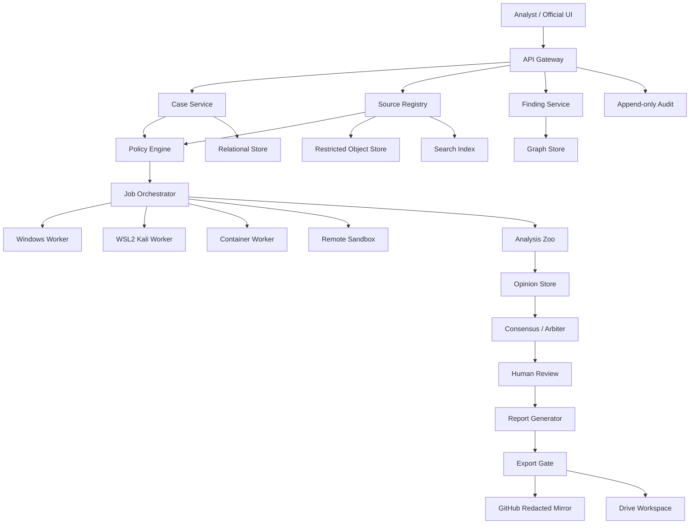

# 05. Системная архитектура

## Сервисы

- **Case Service:** scope, roles, status, basis, retention.
- **Source Registry:** identity, publisher, primary/secondary, reliability, affiliation, limitations.
- **Capture Service:** acquisition, hashing, immutable storage, quarantine.
- **Normalizer:** parsing with stable locators; raw evidence untouched.
- **Claims/Findings:** separate APIs for claims, opinions, findings, risks, decisions.
- **Analysis Zoo:** immutable input bundle, approved analyzers, data boundaries, manifests.
- **Policy Engine:** user/collector/model/tool/export decisions.
- **Tool Orchestrator:** only registered adapters; no unrestricted shell.
- **Report Generator:** official output independent from exploratory UI state.

## Stores

| Store | Содержимое |
|---|---|
| Relational DB | cases, roles, source metadata, workflow |
| Graph DB | entities, typed relations, temporal properties |
| Search index | text/chunks/metadata |
| Opinion store | immutable inputs/outputs/manifests |
| Restricted object store | raw captures/attachments |
| Audit store | append-only events/hashes |
| GitHub | contracts, code, redacted fixtures/reports |
| Drive | editable formal documents/controlled annexes |

## Stable IDs

`CASE-SYNTH-0001`, `SRC-0001`, `CAP-0001`, `ENT-0001`, `REL-0001`, `CLM-0001`, `ARUN-0001`, `OPN-0001`, `CNS-0001`, `FND-0001`, `AUD-0001`, `EXP-0001`.

Display name may change; ID does not.

## UI

`ANALYST`: graph, dossiers, timeline, map, sources, jobs, contradictions.  
`OFFICIAL`: established facts, grades, risks, recommendations, annex links, resolution.

Visual state never changes evidence state.

## Tool profiles

Execution: `WINDOWS_NATIVE`, `WSL2_KALI`, `CONTAINER_ISOLATED`, `REMOTE_SANDBOX`, `MANUAL_EXTERNAL`.

Safety: `PASSIVE_PUBLIC`, `ACTIVE_AUTHORIZED`, `RESTRICTED_FORENSIC`, `PROHIBITED`.

## Reproducibility

Run stores scope revision, input hashes, versions, command/prompt hash, environment, time, raw/normalized outputs, policy decision and human approval.
