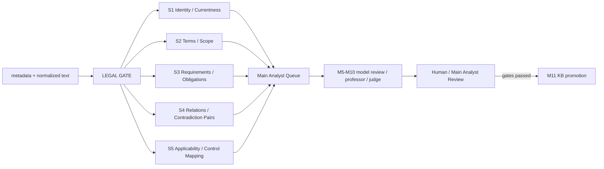

# SECURITY LEGAL ANALYTICS — 5 STREAMS

## RU

### Назначение

Этот слой анализирует **только уже имеющиеся локальные нормативные материалы** из `data/security_current_only`. Он не скачивает документы, не изменяет исходники и не публикует выводы моделей как юридическую истину.



### Потоки

| Поток | Задача | Выход |
|---|---|---|
| S1 | identity, provenance, редакция, currentness, legal gate | `LEGAL_SOURCE_RECORD`, `LEGAL_GATE_DECISION` |
| S2 | термины, определения, область действия, применимость | term/definition/scope candidates |
| S3 | обязанности, запреты, права, сроки | requirement candidates с exact evidence |
| S4 | ссылки между актами, общие области, пары на проверку противоречий | relation candidates + `CONTRADICTION_REVIEW_PAIR` |
| S5 | применимость и связь требований с семействами контролей | control mappings + очередь главному аналитику |

### Fail-closed правила

1. `CURRENT` сам по себе не означает, что документ разрешён к legal promotion.
2. Для promotion требуются `document_identity_confirmed=true` и `currentness_verified=true`.
3. `VERIFY_CURRENTNESS`, `FUTURE_EFFECTIVE`, `SUPERSEDED`, `CONDITIONAL` → `HOLD`.
4. Отсутствующий normalized text → `HOLD_NO_TEXT`.
5. Из непроверенного текста разрешено извлекать **только кандидатов** с `MAIN_ANALYST_REVIEW_REQUIRED`.
6. Три известные `protect.gost.ru/gost/details/...` карточки ГОСТ не считаются полным нормативным текстом автоматически.
7. S4 никогда не утверждает противоречие по ключевым словам. Он создаёт пару для M8.
8. `kb_auto_promotion=false` во всех потоках.

### Запуск

```powershell
cd "G:\1\OSINT_deepseek"
git pull --ff-only
.\RUN_SECURITY_LEGAL_ANALYTICS_5STREAM.cmd
```

### Локальные результаты

- `reports/security_legal_analytics/S1_IDENTITY_CURRENTNESS.json`
- `reports/security_legal_analytics/S2_TERMS_SCOPE.json`
- `reports/security_legal_analytics/S3_REQUIREMENTS_OBLIGATIONS.json`
- `reports/security_legal_analytics/S4_RELATIONS_CONTRADICTIONS.json`
- `reports/security_legal_analytics/S5_APPLICABILITY_CONTROL_MAPPING.json`
- `reports/security_legal_analytics/LATEST_MAIN_ANALYST_QUEUE.json`
- `reports/security_legal_analytics/LATEST_5STREAM_LEGAL_ANALYTICS.json`

Производственная статистика не выдумывается: `speedup_vs_1_stream_pct` и `rework_rate` остаются `null`, пока нет сопоставимой телеметрии.

---

## EN

This layer analyzes **existing local regulatory evidence only**. It performs no acquisition and does not mutate source artifacts. Five concurrent analytical streams cover source/currentness control, terminology/scope, requirements, cross-document relations/contradiction review pairs, and applicability/control mapping. All semantic outputs remain candidates until main-analyst review; KB promotion is deterministic and fail-closed.
