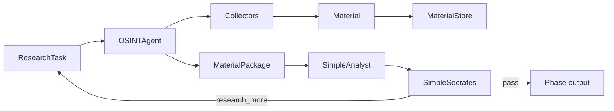

# `father_osint` — current DEV package

**Status:** PROTOTYPE / UNVERIFIED until requirements and tests pass.

## Chain

## Files

- `models.py` — cross-stage data contracts.
- `agent.py` — OSINT collector orchestration.
- `storage.py` — local DEV persistence and obvious-content deduplication.
- `analysis.py` — deterministic DEV Analyst only.
- `socrates.py` — deterministic DEV review only.
- `pipeline.py` — earlier bounded OSINT↔Analyst loop.
- `review_pipeline.py` — OSINT→Analyst→Socrates loop; evaluate overlap before extension.
- `collectors/` — source acquisition boundary.
- `transports/` — experimental protocol adapters.

## Engineering rule

Before changing this package, link the change to `docs/OSINT_AGENT_TZ_V1.md`, `docs/ARCHITECTURE_DEV_V1.md` and an acceptance test. Do not add Knowledge Gate, production schedulers, distributed stores or live credentials during the current DEV verification phase.
