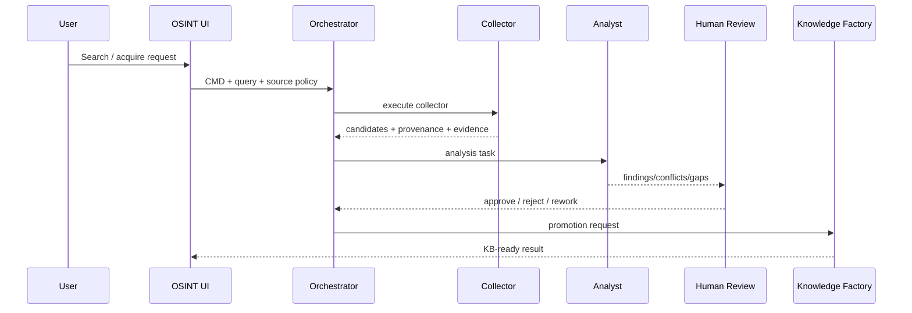

# TRACEABILITY PLAN — FATHER OSINT Control Center

Status: ACTIVE

## Scope

- project_id: `FATHER-OSINT`
- module: `OSINT_CONTROL_CENTER`
- entry point: user action in local web UI or allowlisted launcher
- final outputs: search evidence, acquisition reports, analyst inputs and KB promotion packages

## Roles

| Actor | Responsibility |
|---|---|
| USER | formulates search/research request and approves sensitive/final actions |
| OSINT_UI | creates operator command and displays state/evidence |
| ORCHESTRATOR | validates allowlist, creates task/command/trace IDs, starts worker |
| COLLECTOR | Telegram/Web/GitHub/local source collection |
| ANALYST | evaluates evidence, gaps, conflicts and confidence |
| HUMAN_REVIEWER | confirms promotion or rejects/returns for rework |
| KNOWLEDGE_FACTORY | packages accepted evidence into KB-ready structures |

## Command flow

## Runtime chain example

`TRACE-... / TASK-... / CMD-...`

`USER → UI → TELEGRAM_QUERY_PROBE → probe_osint_query.py → report JSON → analyst/review → next command`.

Every child command keeps `parent_command_id` and the same `correlation_id` for the business operation.

## State flow

`PLANNED → QUEUED → RUNNING → PASS`

Branches: `WAITING_HUMAN`, `FAILED → RETRY`, `FAILED → REWORK`, `BLOCKED`, `CANCELLED`.

## Evidence links

Telegram candidate evidence must retain at least chat/message identity and query provenance. Downloaded payloads add local path and SHA-256. Analyst output references the evidence IDs it used. KB promotion references the reviewed analyst package, never only the raw source.

## UI requirement

The Control Center must expose a Trace view containing:

- correlation/task/command IDs;
- actor and executor;
- command name;
- state transition and duration;
- inputs and outputs;
- evidence links;
- errors/retries/rework;
- parent/child and previous/next commands.

Target presentation: timeline + command graph + event table.

## Acceptance

A Control Center job without command/task/trace linkage is `TRACEABILITY_DEFECT`.
