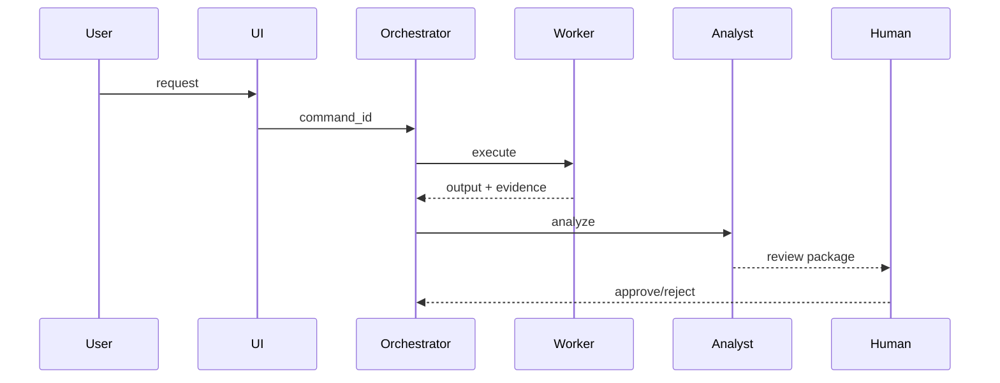
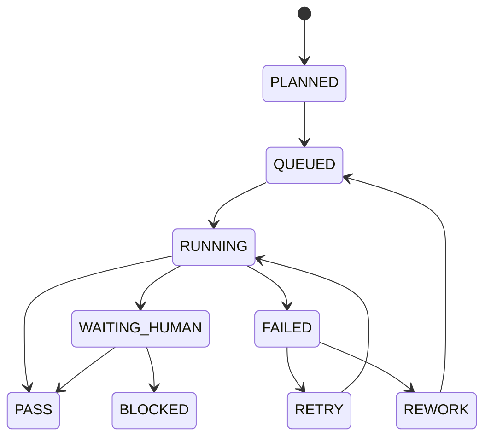

# TRACEABILITY PLAN — <PROJECT / MODULE>

Status: DESIGN REQUIRED BEFORE IMPLEMENTATION

## 1. Scope

- project_id:
- module/development_id:
- owner:
- purpose:
- entry point:
- final output:

## 2. Roles and responsibilities

| Role / actor | Responsibility | Can initiate | Can execute | Can approve | Evidence produced |
|---|---|---:|---:|---:|---|
| USER | | | | | |
| UI | | | | | |
| ORCHESTRATOR | | | | | |
| COLLECTOR / WORKER | | | | | |
| ANALYST | | | | | |
| HUMAN REVIEWER | | | | | |

## 3. Command flow

## 4. State flow

## 5. Command registry

| command_id pattern | Initiator | Executor | Trigger | Input refs | State before | Output refs | State after | Next command |
|---|---|---|---|---|---|---|---|---|
| CMD-... | | | | | | | | |

## 6. Runtime trace fields

Every event records:

`trace_id, correlation_id, project_id, task_id, command_id, parent_command_id, actor_role, initiator, executor, trigger, command_name, input_refs, state_before, started_at, finished_at, status, output_refs, state_after, evidence_refs, error_ref, retry_of, rework_reason, human_approval_ref, next_command_ids`.

## 7. Evidence storage

| Evidence type | Storage | Immutable? | Hash required? | Retention | Linked by |
|---|---|---:|---:|---|---|
| source | | | | | |
| payload | | | | | |
| report | | | | | |
| decision | | | | | |

## 8. UI trace view

Must expose:
- timeline;
- command graph;
- actor/role;
- inputs/outputs;
- state transitions;
- evidence links;
- errors/retries/rework;
- previous/next command.

## 9. Acceptance

- [ ] TRACEABILITY_PLAN complete before implementation
- [ ] Every runtime result has trace/task/command linkage
- [ ] Parent-child commands are reconstructable
- [ ] Human approvals are visible
- [ ] Errors/retries/rework are not overwritten
- [ ] Output/evidence links resolve
- [ ] Trace view exists in UI for operational/showcase systems
